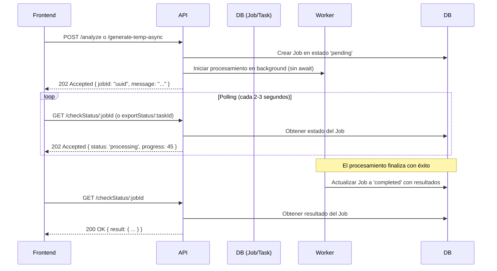

# Documentación de Integración del Frontend, Procesos y Negocio de la API

Esta documentación detalla la arquitectura de controladores (`src/api/controllers/`), las reglas de negocio críticas, los flujos de procesamiento internos de la API y las pautas detalladas para que el equipo de frontend se integre con los endpoints expuestos de manera eficiente.

---

## Sección 1: Documentación para el Frontend (Guía de Integración)

### 1. Autenticación y Seguridad
Todos los endpoints protegidos por la API requieren un token de autenticación JWT. El frontend debe incluir este token en las cabeceras de cada petición HTTP.

*   **Cabecera Obligatoria:**
    ```http
    Authorization: Bearer <JWT_TOKEN>
    ```
*   **Gestión de Sesión:** Si la API devuelve un código de estado `401 Unauthorized`, el frontend debe redirigir al usuario al login y limpiar el token almacenado localmente.

---

### 2. Patrón de Procesamiento Asíncrono (Jobs / Tasks)
Debido a que ciertos cálculos (como la generación masiva de trazabilidad, exportaciones a Excel de miles de filas, o auditorías mediante Inteligencia Artificial) superan el tiempo de respuesta seguro de la pasarela HTTP (Gateway Timeout de 30 segundos), la API implementa un **patrón asíncrono basado en Jobs (Tareas en segundo plano)**.

#### Flujo de Integración Asíncrono:


1.  **Petición Inicial:** El frontend envía la solicitud a un endpoint asíncrono.
2.  **Respuesta Inmediata:** La API responde con un código de estado `202 Accepted` y un cuerpo que contiene el identificador único de la tarea (`jobId` o `taskId`).
3.  **Monitoreo (Polling):** El frontend debe realizar peticiones periódicas (polling) de tipo `GET` al endpoint de estado correspondiente usando el identificador recibido.
4.  **Respuestas de Estado:**
    *   `202 Accepted`: La tarea sigue en proceso (`pending` o `processing`). Puede incluir un porcentaje de `progress`.
    *   `500 Internal Server Error`: La tarea falló (`failed`). El cuerpo contendrá el campo `error`.
    *   `200 OK`: La tarea finalizó correctamente (`completed`). El cuerpo de la respuesta contendrá la carga útil de los datos resultantes.

---

### 3. Comunicación en Tiempo Real vía WebSockets (Socket.IO)
Para notificar al usuario sobre avances en procesos interactivos en lugar de depender únicamente del polling, la API expone un servidor de WebSockets integrado con `socket.io`.

*   **Identificador de Canal (Salas):** Las conexiones se agrupan en salas utilizando el `officeId` del usuario.
*   **Lógica de Notificación en Servidor:**
    El servidor utiliza la utilidad `notifyWebEvents(officeId, severity, message, data, action)` para difundir eventos.
*   **Eventos de Interés para el Frontend:**
    *   **Evento `info`:** Actualizaciones generales de progreso legibles para el usuario.
    *   **Evento `warning` / `error`:** Alertas sobre anomalías en el procesamiento del scanner u OCR.
    *   **Evento con Acción `process-completed-dr`:** Notificación de que un lote de PDFs escaneados ha terminado de digitalizarse. El frontend debe escuchar este evento para actualizar la vista de la bandeja de reportes diarios temporales.

---

### 4. Flujo de Escaneo de Reportes Diarios (OCR & Gemini)
El frontend puede cargar PDFs correspondientes a reportes diarios físicos para que la API extraiga los datos automáticamente mediante Azure Form Recognizer y Google Gemini.

#### Flujo del Procesamiento de Archivos:
1.  **Carga del Archivo:** El frontend envía los archivos binarios utilizando `FormData` al endpoint de carga.
    *   *Módulo multer:* El backend recibe los archivos usando `upload.array('files')`.
2.  **Validación y División:** Si un PDF es muy pesado o contiene múltiples páginas, el backend lo divide temporalmente (con `splitFileIfNeededReports`) para optimizar el análisis.
3.  **Almacenamiento temporal en la nube:** Cada página se sube a Cloudinary (`costeo/daily-reports`).
4.  **Extracción Multimodal Paralela:** Las páginas se envían a Azure Document Intelligence/Gemini en hilos paralelos limitados por la variable `MAX_CONCURRENT_FILES` (evitando límites de tasa HTTP 429).
5.  **Recepción Temporal:** Los JSON resultantes de la extracción se guardan temporalmente en la colección `tempDailyReports` vinculados al `socketId` del cliente.
6.  **Notificación de Finalización:** Se envía un evento socket `process-completed-dr` al frontend.
7.  **Consumo y Guardado:** El frontend consume `POST /temp-daily-reports` enviando su `socketId` para recuperar los reportes digitalizados, permite que el usuario los revise/corrija en la interfaz y finalmente los persiste permanentemente en la base de datos.

---

### 5. Flujo de Trabajo de la Trazabilidad Temporal (Temp Session)
La trazabilidad cruza la información de las partidas y jornadas operadas contra el catálogo maestro de TEBs para imputar los costos correctamente. Para evitar dañar el historial financiero del contrato con cálculos erróneos, se utiliza una **Sesión Temporal**.

```
[Iniciar Sesión] POST /generate-temp-async (Rango de fechas)
       │
       ▼
[Previsualizar] GET /temp/:sessionId (Devuelve lista paginada y filtrada de TrazabilityTempModel)
       │
       ├─► [Editar Registro] PUT /temp/updateRecord (Ajuste manual de volúmenes o instalaciones)
       │
       ├─► [Descartar Sesión] DELETE /temp/:sessionId (Borra TrazabilityTempModel)
       │
       └─► [Confirmar Sesión] POST /commit/:sessionId
                 │
                 ├──► (Si tiene requestNo real) ──► Guarda en TrazabilityHistoryModel (Historial)
                 └──► (Si requestNo es X / vacío) ──► Guarda en TraceabilityProrrateoModel (Prorrateo)
```

> [!IMPORTANT]
> **Modo Simulado (`isSimulated = true`):** El frontend puede enviar `isSimulated: true` al inicializar la sesión temporal. Esto generará la trazabilidad utilizando datos ficticios (mocks) para TEBs inexistentes, lo cual es ideal para pruebas rápidas de cálculo. **Las sesiones simuladas tienen bloqueado el commit a producción.**

---

### 6. Integración del Motor de Inteligencia Artificial (IA-Analista)
El módulo de análisis permite generar interpretaciones estratégicas de los costos operativos y de mantenimiento bajo la proza del "Estilo Nicolás".

#### Tipos de Análisis (Mission):
*   **Macro:** Analiza todo el rango del dashboard consolidando un reporte ejecutivo global de 8 puntos clave.
*   **Micro:** Analiza un gráfico o tarjeta específica del dashboard (enviando la propiedad `focus`, por ejemplo: `"Costos por Categoría"`, `"Mantenimiento"`, `"Matriz"`, `"Metas"`).

#### Payload de Ejemplo (Petición Live):
El frontend solicita el análisis indicando rango de fechas y misión. El backend consultará automáticamente `dashboardService` para alimentar a los LLMs.
```json
{
  "source": "live",
  "mission": "micro",
  "focus": "Costos por Categoría",
  "startDate": "2026-01-01",
  "endDate": "2026-02-16"
}
```

#### Payload de Ejemplo (Fallback Frontend):
Si el frontend ya posee los datos de ECharts y desea ahorrar consultas a la base de datos, puede enviar los datos serializados directamente:
```json
{
  "source": "frontend",
  "mission": "micro",
  "focus": "Global",
  "data": {
    "periodo_analisis": "Febrero 2026",
    "contract": {
      "montoTotal": 5000000,
      "montoEjecutado": 1854320.50,
      "fechaInicio": "2025-10-01",
      "fechaFin": "2026-10-01"
    },
    "series": [
      {
        "name": "Alta Actividad",
        "data": [
          { "value": [4, 301550.40], "name": "PARTIDA 57.8 - GRUA 45" }
        ]
      }
    ]
  }
}
```

---

## Sección 2: Guía de Procesos y Negocio por Carpeta de Controladores

Esta sección detalla el propósito de negocio, los endpoints expuestos y los flujos lógicos de procesamiento interno para cada una de las 17 carpetas de controladores en `src/api/controllers/`.

---

### 1. `ActivityController`
*   **Propósito de Negocio:** Administra las actividades horarias detalladas de los reportes diarios de los equipos o cuadrillas. Las actividades especifican si un recurso estuvo en Operación (OP), Disponibilidad (DISP), Mantenimiento (MTTO) o Fuera de Servicio (FS).
*   **Reglas de Negocio Críticas:**
    *   **Validación de Solapamiento:** No se permite que un mismo recurso tenga actividades que se superpongan en horario durante el mismo día de reporte.
    *   **Prioridad de Campos:** Los campos `targetInstallationActivie` (instalación destino), `shipActivie` (embarcación) y `serviceInstallationActivie` (instalación de servicio) declarados a nivel de actividad **tienen mayor prioridad y sobrescriben** las instalaciones configuradas en la cabecera del reporte al generar la trazabilidad.
*   **Endpoints Clave:**
    *   `POST /createActivity`: Crea una actividad y valida los límites de tiempo.
    *   `GET /getAllActivities`: Retorna todas las actividades registradas.
    *   `GET /getActivityById/:id`: Obtiene una actividad específica.
    *   `PUT /updateActivity/:id`: Modifica la actividad y desencadena el recálculo automático del día de trabajo en la partida.
    *   `DELETE /deleteActivity/:id`: Elimina la actividad.
*   **Flujo de Proceso:**
    ```text
    Petición (Body con horas y tipo)
       ↓
    Validar solapamientos (helperReportService.checkActivityOverlap)
       ↓
    Guardar ActivityModel
       ↓
    Llamar a recálculo del laborDay del equipo correspondiente (recalculateResourceDailyState)
    ```

---

### 2. `AnuncioController`
*   **Propósito de Negocio:** Permite publicar anuncios generales o alertas informativas en la plataforma para todos los usuarios conectados.
*   **Endpoints Clave:**
    *   `POST /`: Crea un nuevo anuncio en la base de datos.
    *   `GET /`: Obtiene la lista de anuncios ordenados por fecha de publicación.
    *   `PUT /:id`: Actualiza un anuncio existente.
    *   `DELETE /:id`: Elimina el anuncio del sistema.
*   **Flujo de Proceso:** El controlador almacena el anuncio y utiliza el Socket Manager para difundir una notificación global a todos los clientes que se encuentran activos.

---

### 3. `BaseTebController`
*   **Propósito de Negocio:** Gestiona los TEBs (Técnico Económico Base), CABs y CAXs del contrato. Estos documentos presupuestales actúan como el destino financiero donde se imputan los costos de la trazabilidad.
*   **Reglas de Negocio Críticas:**
    *   **Tratamiento de Fechas:** Todas las fechas son tratadas en formato UTC medianoche para evitar desalineaciones por huso horario.
    *   **Carga en Chunks:** La importación de Excel/CSV masivos que contienen decenas de miles de registros se divide en lotes pequeños (500-1000 registros) procesados vía `bulkWrite` para evitar la desconexión o saturación de la base de datos MongoDB (`read ECONNRESET`).
*   **Endpoints Clave:**
    *   `POST /uploadTebsManual` / `/uploadTebsScanner`: Carga y almacena los archivos PDF de soporte de los TEBs.
    *   `POST /insertTebsMassive` / `/importExcelChunk`: Importación masiva por bloques de datos estructurados de TEBs.
    *   `PUT /updateOne/:_id`: Actualiza campos maestros como `placeServiceProvided` (instalación).
    *   `POST /generateTebWhitePaper`: Genera un archivo ZIP con los documentos en PDF asociados al TEB.
    *   `GET /listTebsNotInActivity`: Retorna TEBs que no han sido asociados a ninguna actividad del reporte.
*   **Flujo de Proceso:**
    ```text
    Archivo Excel subido
       ↓
    Lectura de filas (exceljs) y mapeo a campos Mongoose
       ↓
    Conversión de fechas con parseDateBaseTeb
       ↓
    Agrupación en bloques de 500 registros
       ↓
    Ejecución de bulkWrite (updateOne + upsert: true) en MongoDB
    ```

---

### 4. `CatalogConceptController`
*   **Propósito de Negocio:** Administra los conceptos de catálogo de documentos de soporte y las clasificaciones presupuestales utilizadas en la aplicación.
*   **Endpoints Clave:** Expone endpoints tipo CRUD estándar de Mongoose para controlar el tipo y código de los documentos relacionados con las solicitudes del contrato.

---

### 5. `CatalogEquipmentController`
*   **Propósito de Negocio:** Gestiona el catálogo físico de equipos permitidos en el contrato (grúas, tractocamiones, maniobristas, etc.).
*   **Reglas de Negocio Críticas:** Cada equipo posee propiedades financieras unitarias (tasas horarias o diarias) que se inyectan dinámicamente a los subitems asociados a las partidas presupuestales.
*   **Endpoints Clave:**
    *   CRUD estándar para el registro de equipos, vinculados a la colección `CatalogEquipmentModel`.

---

### 6. `ConfigController`
*   **Propósito de Negocio:** Gestiona catálogos dinámicos globales (`CatalogListModel`) como los nombres de barcos (`ship`), instalaciones destino (`installationDestination`) e instalaciones de servicio (`serviceInstallation`).
*   **Reglas de Negocio Críticas:**
    *   **Uso de Llaves (Keys):** El sistema almacena únicamente los `ObjectId` de los catálogos en los reportes y actividades. Durante listados y reportes Excel, el backend hace una conversión utilizando un mapa en memoria indexado por la conversión a string `String(objectId)` para asegurar eficiencia y evitar el patrón de consulta N+1.
*   **Endpoints Clave:**
    *   `POST /createCatalogList`: Crea un catálogo individual.
    *   `POST /bulkCreateCatalogList`: Inserción masiva optimizada por bloques (chunks).
    *   `GET /getListByCode/:code`: Obtiene la lista filtrada por tipo de catálogo (ej. 'ship').
    *   `GET /getListByCodeFillter/:code`: Búsqueda paginada y filtrada.

---

### 7. `ConnectionController`
*   **Propósito de Negocio:** Controla los perfiles de usuario, credenciales de conexión y parámetros iniciales de sesión en el sistema.
*   **Endpoints Clave:**
    *   CRUD de configuraciones de conexión.
    *   `GET /getProfiles`: Obtiene los roles y permisos que el frontend requiere para dibujar los menús y vistas.

---

### 8. `DailyReportController`
*   **Propósito de Negocio:** Administra la creación, digitalización y aprobación de los reportes diarios de trabajo de equipos y cuadrillas.
*   **Reglas de Negocio Críticas:**
    *   **Restricción de Cabos:** Si un reporte es de tipo Cabos (`caboServiceDay = true`), solo se permite asignar **un único ID de cabos** (`caboIds.length <= 1`).
    *   **Suma de Jornada:** Los valores de operación (`valueOperation`), disponibilidad (`valueAvailable`), mantenimiento (`valueMaintenance`) y fuera de servicio (`valueOutOfService`) deben sumar **exactamente 1.00** para reportes operativos estándar.
    *   **Redistribución y Ajustes:** Para mitigar discrepancias por redondeo al dividir turnos, se utiliza la propiedad `isAdjustment` del catálogo de jornadas para inyectar decimales residuales en el subturno asignado.
*   **Endpoints Clave:**
    *   `POST /upload`: Digitalización masiva en segundo plano desde el frontend (devuelve `sessionId`).
    *   `GET /session/:sessionId`: Polling del estado de la extracción OCR del lote.
    *   `POST /temp-daily-reports`: Recupera reportes digitalizados temporales para corrección manual.

---

### 9. `DepartureControllers`
*   **Propósito de Negocio:** Gestiona las Partidas Presupuestales (`DepartureModel`), las cuales definen las condiciones contractuales del cobro de equipos (tarifas, tipo de jornada, etc.) y los equipos físicos asignados a ellas (`SubItemsModel`).
*   **Reglas de Negocio Críticas:**
    *   **Cálculo de Kilometraje (Fletes):** Los reportes de fletes asignan volumen basándose en rangos de kilometraje directo por bloque de partidas (ya no es un cálculo acumulativo acumulable general).
    *   **Extracción aplanada (getDepartureLimit):** Es el motor primario que itera subitems, días laborados y desgloses de actividades, y retorna una estructura aplanada tipo `IPrepareTraceability[]` lista para ser cruzada con TEBs.
*   **Endpoints Clave:**
    *   `POST /createDeparture`: Registra una nueva partida.
    *   `POST /addSubItem` / `addMultipleSubItems`: Asigna equipos al cobro de la partida.
    *   `GET /getViewAllLimit/:startDate/:endDate`: Retorna las partidas operadas en un rango de fechas con su desglose aplanado.
    *   `GET /getHierarchicalData/:month/:year`: Datos jerárquicos de partidas y costos para el consumo de gráficos en frontend.

---

### 10. `FictitiousTebController`
*   **Propósito de Negocio:** Permite la creación y gestión de TEBs ficticios (`FictitiousTebModel`).
*   **Reglas de Negocio Críticas:** Cuando la trazabilidad encuentra reportes de trabajo que asocian un TEB, CAB o CAX que no existe en el catálogo maestro, se genera un mock o registro ficticio para evitar el bloqueo del cálculo financiero general de la trazabilidad.
*   **Endpoints Clave:**
    *   `POST /createFictitiousTeb`: Crea un TEB ficticio con folio autogenerado.
    *   `GET /getLastFolioTebFictitious`: Obtiene el folio correlativo disponible.

---

### 11. `GeneratorController`
*   **Propósito de Negocio:** Módulo técnico encargado de generar folios secuenciales únicos para reportes y estimaciones de cobro.
*   **Endpoints Clave:** CRUD de folios y estados del generador.

---

### 12. `JornDayControllers`
*   **Propósito de Negocio:** Define las jornadas de trabajo (matutina, nocturna, mixta, etc.) con sus respectivas horas de inicio y finalización.
*   **Reglas de Negocio Críticas:** Alberga la configuración de `isAdjustment` la cual decide qué jornada del día absorberá las desviaciones decimales en redondeo de subjornadas.
*   **Endpoints Clave:**
    *   `GET /listJornDaysShort`: Lista de jornadas optimizada para selectores del frontend.

---

### 13. `ReportControllers`
*   **Propósito de Negocio:** Coordina la consistencia de los reportes diarios e interactúa con el recálculo masivo de las partidas.
*   **Reglas de Negocio Críticas:**
    *   **Recálculo unitario (`recalculateDeparture`):** Permite recalcular un único subitem de flete o equipo de forma individual sin la necesidad de rehacer los cálculos de todo el mes de base de datos.
*   **Endpoints Clave:**
    *   `POST /validate-volume`: Valida en tiempo real si el volumen diario de un equipo no excede el límite de 1.0.
    *   `POST /bulk-recalculate`: Desencadena el recálculo general de todos los labor days del mes.
    *   `POST /bulk-recalculate-prices`: Actualiza los importes monetarios históricos si cambian los precios unitarios de las partidas.

---

### 14. `ResourceControllers`
*   **Propósito de Negocio:** Administra el catálogo maestro de recursos del sistema (tanto personal operativo como materiales auxiliares).
*   **Endpoints Clave:** CRUD estándar para control de recursos en el sistema.

---

### 15. `TraceabilityController`
*   **Propósito de Negocio:** El motor de integración financiera central del sistema. Cruza la información del trabajo reportado por los equipos y fletes contra los TEBs activos.
*   **Reglas de Negocio Críticas:**
    *   **Prioridad de Instalación:** La instalación asignada a la fila de trazabilidad (`installation`) se define con la siguiente prioridad estricta:
        1.  Instalación definida en la Actividad del reporte (`ActivityModel`).
        2.  Instalación del catálogo de TEB (`BaseTebsModel`).
        3.  Fallback por defecto (`'X'`).
    *   **Destino de Persistencia:** Al confirmar una sesión temporal, los registros con `requestNo` real se guardan en `TrazabilityHistoryModel`; mientras que los registros sin solicitud o marcados con "X" se guardan en `TraceabilityProrrateoModel` (Prorrateo).
    *   **Deduplicación:** Agrupa el volumen en base a una clave compuesta: `día | equipo | partida | Inside/Outside | activityId`.
*   **Endpoints Clave:**
    *   `POST /generate-temp-async`: Inicia la generación asíncrona de una sesión temporal y devuelve un `taskId`.
    *   `GET /temp/:sessionId`: Obtiene los resultados de la sesión temporal con filtros y paginación.
    *   `POST /commit/:sessionId`: Confirma y mueve los datos a las tablas definitivas de producción.
    *   `DELETE /temp/:sessionId`: Descarta la previsualización temporal.
    *   `POST /traceabilityExcelReportAsync`: Genera un reporte Excel masivo en segundo plano.

---

### 16. `dashboardController`
*   **Propósito de Negocio:** Calcula métricas, costos reales agrupados por categorías, costos de mantenimiento, e información consolidada para alimentar las gráficas interactivas del frontend.
*   **Endpoints Clave:**
    *   `GET /getActualCostsByCategory`: Obtiene sumatorias de costo real productivo agrupado por categoría de equipo.
    *   `POST /loadDashBoardScatter`: Alimenta la gráfica de dispersión cruzando volumen contra importes de equipos.
    *   `GET /getTotalCostsComparedWithGoal`: Compara el avance global monetario contra la meta del contrato.
    *   `POST /cronJob/refresh`: Regenera la caché de métricas en la base de datos de manera manual.

---

### 17. `iaAnalistaController`
*   **Propósito de Negocio:** Orquesta las consultas asíncronas hacia los modelos de lenguaje de gran tamaño (LLM) Claude y Gemini para generar análisis y validaciones estadísticas de costes.
*   **Reglas de Negocio Críticas:**
    *   **Orquestación en 2 Fases (Map-Reduce + Validador):**
        1.  **Fase Map-Reduce (Claude):** Genera interpretaciones escritas de los KPI del dashboard.
        2.  **Fase de Auditoría Invisible (Gemini):** Lee el reporte de Claude y los datos duros reales del backend. Corrige de forma silenciosa cualquier discrepancia numérica en la proza de Claude para garantizar 100% de consistencia de los datos financieros.
*   **Endpoints Clave:**
    *   `POST /analyze`: Inicia un análisis asíncrono basado en datos pasados en el body o live source. Devuelve `jobId`.
    *   `GET /checkStatus/:jobId`: Polling para obtener el progreso o JSON del reporte final auditado.
